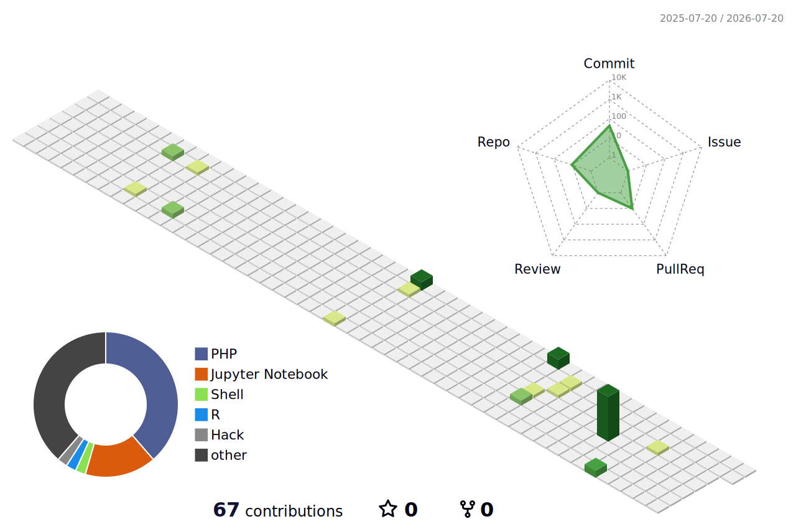

<h1 align="center">
    
</h1>

<h3 align="center">A passionate CSE student & developer from Bangladesh 🇧🇩</h3>

 

 
 🔭 I’m currently working on <b>OpenGL Simulations, AI Research & Smart Systems</b> 
 🌱 I’m currently learning <b>Machine Learning, Deep Learning, Cloud Computing & Advanced Software Development</b> 
💬 Ask me about <b>C++, OpenGL, Python, Research, Web Development & AI Tools</b> 
⚡ Fun fact: <b>I enjoy building realistic simulations and intelligent systems</b>

 

 
  

  

  

   

<h2 align="center">⚒️ Languages • Frameworks • Tools ⚒️</h2>

 

    
     
    
     
    

 

  <h2>🚀 Featured Projects 🚀</h2>
  
  ✈️ <b>Village Scenario Simulation with Day/Night & Weather Effects</b> 
  🚌 <b>Smart Public Transport Safety System</b> 
  🏙️ <b>Realistic Town & Village Environment Simulation</b> 
  🤖 <b>AI & Deep Learning Based Research Projects</b>

 

  <h2>📚 Research Interests 📚</h2>

   Artificial Intelligence & Machine Learning  
   Deep Learning & Computer Vision  
   Human Computer Interaction  
   Computer Graphics & Simulation

 

<h2 align="center">⚡ GitHub Stats ⚡</h2>

## ⚡ GitHub Stats ⚡

  

### 📊 My 3D Contribution Graph

 

  

  

  <h2>🏆 Achievements & Activities 🏆</h2>

  🎓 Computer Science & Engineering Student at AIUB  
  📚 Active Research Enthusiast  
  💻 OpenGL Simulation Developer  
  🤖 AI & Machine Learning Learner  
  🌟 Passionate About Innovation & Problem Solving

 

✨ Thanks for visiting my profile ✨

